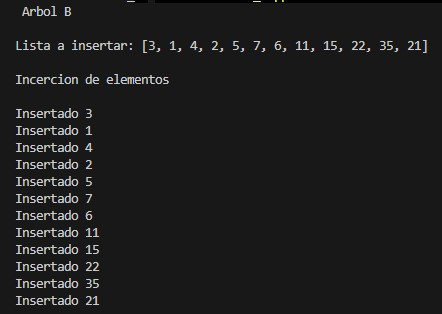
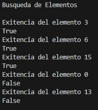
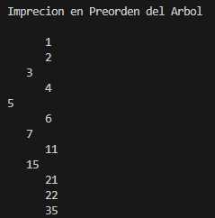

# B-Tree Data Structure Implementation in Python

Implementation of a B-Tree data structure developed in Python.

This project demonstrates the creation and manipulation of a balanced tree structure, including node creation, key insertion, node splitting, searching operations, and preorder traversal.

The implementation uses the B-Tree insertion algorithm to maintain balanced nodes while inserting multiple keys.

---

## Features

- B-Tree implementation using Object-Oriented Programming
- Node creation and management
- Configurable tree degree
- Multiple key storage per node
- Key insertion
- Automatic node splitting
- Recursive search operation
- Preorder tree traversal
- Tree structure visualization
- Search validation for existing and non-existing values

---

## Data Structure

### B-Tree

A B-Tree is a self-balancing multi-way search tree commonly used in databases, file systems, and large-scale data storage systems.

Unlike Binary Search Trees, B-Trees allow multiple keys and children inside each node, reducing the tree height and improving search efficiency.

The main characteristics of a B-Tree are:

- Each node can contain multiple keys.
- Keys inside nodes remain sorted.
- Internal nodes can contain multiple children.
- The tree remains balanced after insertions.
- Nodes split automatically when they reach maximum capacity.

---

## Implementation Details

The project contains two main classes:

### Node

Represents each node inside the B-Tree.

Contains:

- Tree degree
- Stored keys
- Child references
- Number of keys stored
- Leaf node validation

---

### BTree

Controls the operations performed on the structure:

- Insert new keys
- Split full nodes
- Search elements
- Traverse the tree

---

## Algorithms Implemented

### B-Tree Insertion

The insertion algorithm verifies if a node is full before inserting a new key.

When a node reaches its maximum number of keys:

- The node is divided into two child nodes.
- The middle key is promoted to the parent node.
- The remaining keys are distributed between the new nodes.

This process keeps the tree balanced.

---

### B-Tree Search

The search algorithm compares the requested key with the keys stored in each node.

Depending on the comparison result, the algorithm recursively moves through the corresponding child node until:

- The key is found.
- The search reaches a leaf node without finding the value.

---

### Preorder Traversal

The traversal algorithm displays the internal structure of the B-Tree by visiting nodes recursively.

The output represents:

- Tree levels
- Stored keys
- Child relationships

---

## Technologies

- Python 3
- Object-Oriented Programming
- Recursive Algorithms
- Tree Data Structures

---

## How It Works

The program creates a B-Tree with the following degree:

```text
t = 2
```

The following values are inserted into the tree:

```text
3, 1, 4, 2, 5, 7, 6, 11, 15, 22, 35, 21
```

During the insertion process, the program performs automatic node splitting when necessary.

After building the tree, several search operations are executed.

Existing values tested:

```text
3
6
15
```

Non-existing values tested:

```text
0
13
```

Finally, the program displays the final B-Tree structure using preorder traversal.

---

## Project Structure

```text
b-tree-data-structure-implementation-python/
│
├── assets/
│   └── images/
│       ├── btree_insertion_process.jpg
│       ├── btree_search_operations.jpg
│       └── btree_preorder_output.jpg
│
├── b_tree_implementation.py
├── LICENSE
├── .gitignore
└── README.md
```

---

# Screenshots

## B-Tree Insertion Process

Execution showing the insertion sequence of values into the B-Tree.



---

## Search Operations

Execution results showing successful and unsuccessful searches inside the B-Tree.



---

## Preorder Tree Output

Visualization of the B-Tree structure after completing the insertion process.



---

## Educational Objectives

This project was developed to study advanced tree-based data structures and their applications.

The implementation focuses on:

- Balanced tree structures
- Multi-way search trees
- Node splitting techniques
- Recursive tree algorithms
- Key organization inside nodes
- Efficient searching strategies

---

## Notes

The project preserves the original implementation developed for academic learning purposes.

The implementation demonstrates the main operations of a B-Tree, including insertion, node splitting, searching, and traversal.

This project was developed as part of the study of Data Structures and Algorithms.

---

## Author

**Jose Luis Alva Salazar**

Computer Systems Engineering

GitHub Portfolio Project
